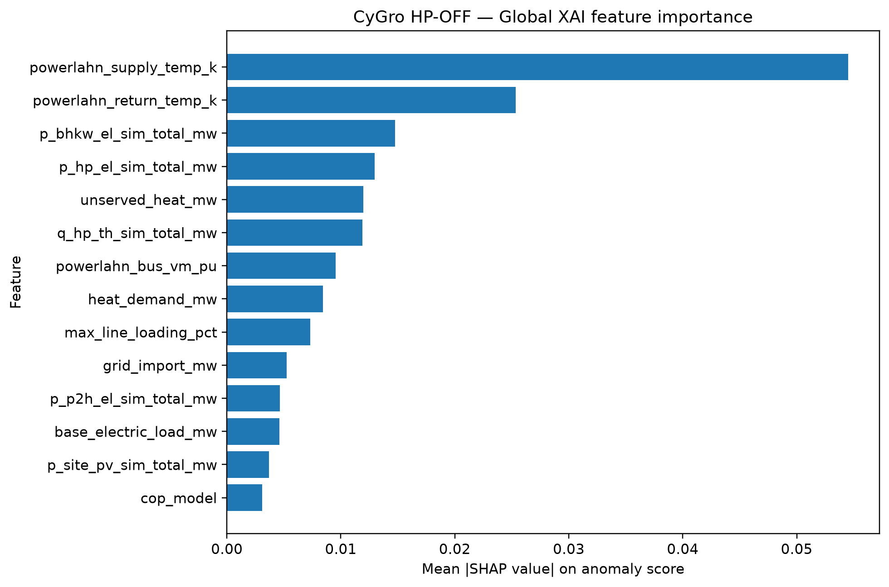
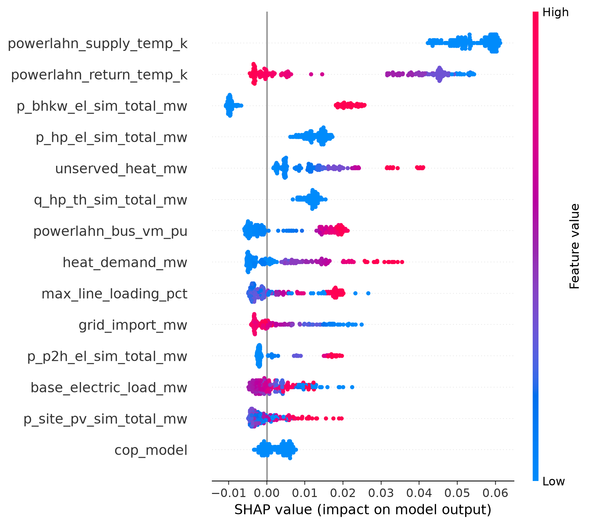
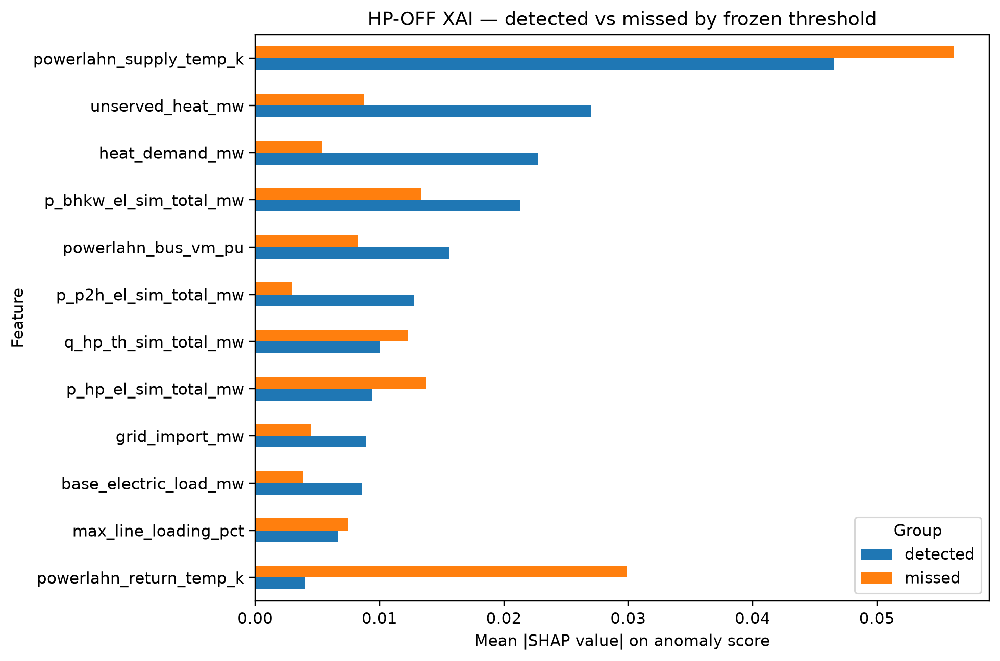

# ML-Based Energy Anomaly Detection

End-to-end machine-learning project for anomaly detection in sector-coupled power and heating systems.

## Overview

This project combines 15-minute multivariate energy-system data, feature engineering, a regime-aware Isolation Forest, physical heat-pump fault validation, reproducible inference, FastAPI deployment and SHAP-based Explainable AI.

## Anomaly Detection

A frozen Isolation Forest detects abnormal operating conditions across coupled electrical and heating-system variables.

### HP-OFF validation

- ROC-AUC: **0.9597**
- PR-AUC: **0.9113**
- HP-OFF observations: **399**
- Detected at frozen threshold: **35**
- Recall at frozen threshold: **8.77%**

The model provides strong score-level separation, while the frozen operating threshold is deliberately conservative.

## Explainable AI

SHAP explains the same anomaly score used by the frozen model:

`anomaly_score = -IsolationForest.score_samples(X)`

The XAI workflow provides global feature attribution, local anomaly explanations, SHAP waterfall plots, beeswarm analysis and detected-vs-missed fault comparison.

The XAI implementation reproduced the frozen HP-OFF anomaly scores exactly:

- Maximum absolute score difference: **0**
- Mean absolute score difference: **0**

## Global HP-OFF SHAP Results

| Feature | Relative importance |
|---|---:|
| Heating-network supply temperature | 30.61% |
| Heating-network return temperature | 14.23% |
| CHP electrical output | 8.29% |
| HP electrical power | 7.28% |
| Unserved heat | 6.71% |
| HP thermal output | 6.68% |
| Bus voltage | 5.37% |
| Heat demand | 4.73% |
| Maximum line loading | 4.11% |
| Grid import | 2.95% |

The results indicate that HP outages are identified through both local HP behaviour and disturbance propagation across the coupled power-heat infrastructure.

SHAP attribution explains model behaviour and does not prove physical causality.

## XAI Figures

### Global Feature Importance

### SHAP Beeswarm

### Detected vs Missed HP-OFF Events

## Technologies

Python, pandas, NumPy, scikit-learn, Isolation Forest, SHAP, matplotlib, joblib and FastAPI.

## Data

Raw CyGro simulation and infrastructure datasets are not included in this public repository.
